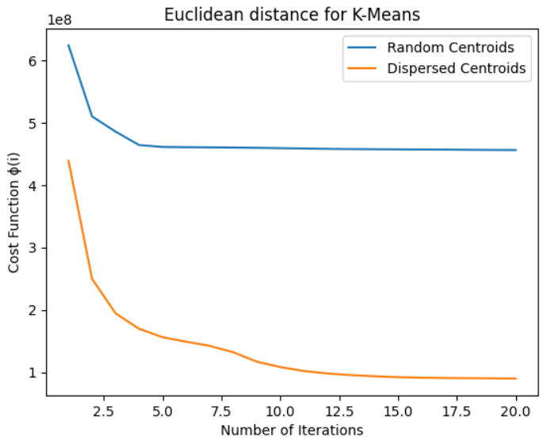
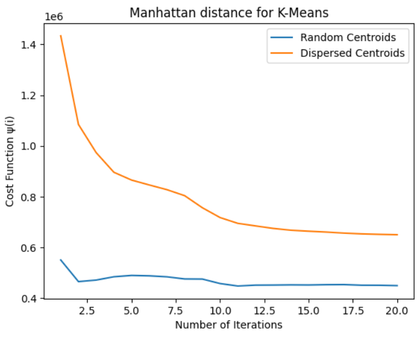

## 1 Implementing k-means on Spark

(a)

1. The values of the cost function for every iteration using `c1.txt` are:

   [623660345.3064113, 509862908.2975454, 485480681.8720084, 463997011.68501294, 460969266.5729968, 460537847.9827684, 460313099.6535447, 460003523.8894081, 459570539.3177352, 459021103.3422909, 458490656.1919812, 457944232.5879751, 457558005.1986773, 457290136.35230196, 457050555.05956286, 456892235.61535585, 456703630.7370345, 456404203.01897514, 456177800.541994, 455986871.0273468]

   The values of the cost function for every iteration using `c2.txt` are:

   [438747790.02791756, 249803933.62600276, 194494814.40631253, 169804841.4515432, 156295748.8062759, 149094208.10896596, 142508531.61961532, 132303869.40652987, 117170969.83719075, 108547377.17857003, 102237203.3179959, 98278015.74975666, 95630226.12177408, 93793314.051193, 92377131.96821065, 91541606.25423889, 91045573.83042458, 90752240.10140811, 90470170.18122731, 90216416.1756313]

   The plot is shown below:

   

2. Percentage change for `c1.txt`: 26.5%. Percentage change for `c2.txt`: 76.7%.

   Random initialization of k-means using `c1.txt` is not better than initialization using `c2.txt` in terms of cost $\phi(i)$.  Dispersed initialization in `c2.txt` is better. 

   Reason: From the plot we can see that dispersed initialization has a start point with the cost less than random initialization. It ends up having a less final cost after 20 iterations as well. Also dispersed initialization has a larger percentage change, which means the decrease rate is larger, which leads to a better performance. The reason is because Euclidean k-means is sensitive to the initial placement of centroids. Random initialization may lead to centroids being placed far from the actual clusters, making convergence slower and increasing the likelihood of getting stuck in local optima. By using a dispersion-based initialization, the algorithm starts with centroids that are more likely to be close to the actual cluster centers since the centroids are far away enough and less overlap, reducing the risk of convergence to suboptimal solutions.

(b)

1. The values of the cost function for every iteration using `c1.txt` are:

   [550117.1419999995, 464869.2758792968, 470897.382277298, 483914.4091733451, 489216.07100343006, 487629.66854997986, 483711.9232137447, 475330.77349323116, 474871.2388463625, 457232.92011507833, 447494.38619735045, 450915.0125766762, 451250.36707256647, 451974.59553974995, 451570.36406995635, 452739.01136645605, 453082.73028718407, 450583.670860298, 450368.74931674276, 449011.36372551974]

   The values of the cost function for every iteration using `c2.txt` are:

   [1433739.3099999954, 1084488.7769648773, 973431.7146620404, 895934.592563071, 865128.3352940815, 845846.647031348, 827219.5827561248, 803590.3456011117, 756039.5172761207, 717332.9025432297, 694587.9252526882, 684444.5019967904, 674574.7475478561, 667409.469916028, 663556.6278215044, 660162.7772287563, 656041.3222947121, 653036.7540731612, 651112.4262522729, 649689.0131843555]

   The plot is shown below:

   

2. Percentage change for `c1.txt`: 18.7%. Percentage change for `c2.txt`: 51.6%.

   Random initialization of k-means using `c1.txt` is better than initialization using `c2.txt` in terms of cost $\psi(i)$. Random initialization in `c1.txt` is better. 

   Reason: From the plot we can see that ransom initialization has a start point with the cost less than dispersed initialization. It ends up having a less final cost after 20 iterations as well. So random initialization has a better performance. This is because `c2.txt` is generated based on Euclidean distance. The centroids may not be the furthest for Manhattan distance. Here random initialization may explore a wider range of starting points, therefore leads to better performance.

## 2 Recommender System

(a) $T_{ii}$ is the node degree of user node $i$, because it's the number of items that user $i$ likes. $T_{ij}$ is the number of paths between user node $i$ and user node $j$, because it's the number of items that both user $i$ and $j$ like.

(b) 

1. Consider $(Q^{-\frac{1}{2}}R^TRQ^{-\frac{1}{2}})_{ij}$, which is the $ith$ row of $Q^{-\frac{1}{2}}R^TR$ times the $jth$ column of $Q^{-\frac{1}{2}}$. Therefore,  $(Q^{-\frac{1}{2}}R^TRQ^{-\frac{1}{2}})_{ij} = \Sigma_{k = 1}^{n}(Q^{-\frac{1}{2}}R^TR)_{ik} \times (Q^{-\frac{1}{2}})_{kj}$. Since $Q$ is a diagonal matrix, therefore $(Q^{-\frac{1}{2}})_{ij}\ (i \neq j) = 0$. Therefore,  $(Q^{-\frac{1}{2}}R^TRQ^{-\frac{1}{2}})_{ij} = (Q^{-\frac{1}{2}}R^TR)_{ij} \times (Q^{-\frac{1}{2}})_{jj}$. Similarly, $(Q^{-\frac{1}{2}}R^TR)_{ij} = (Q^{-\frac{1}{2}})_{ii} \times (R^TR)_{ij}$. Let $R_i^T$ denote the $ith$ row of $R^T$. Since $||R_i^T|| = \sqrt{\Sigma_{k = 1}^{m}(R_{ik}^T)^2} = \sqrt{\Sigma_{k = 1}^{m}R_{ik}^T}$ because each $R_{ik}^T$ is 1 or 0, and $\sqrt{\Sigma_{k = 1}^{m}R_{ik}^T} = \sqrt{Q_{ii}}$ because $\Sigma_{k = 1}^{m}R_{ik}^T$ denotes the total number of users that likes the item $i$. Therefore $(Q^{-\frac{1}{2}})_{jj} = \frac{1}{\sqrt{Q_{jj}}} = \frac{1}{||R_j^T||},\ (Q^{-\frac{1}{2}})_{ii} = \frac{1}{\sqrt{Q_{ii}}} = \frac{1}{||R_i^T||}$. Also we have $(R^TR)_{ij} = \Sigma_{k = 1}^mR_{ik}^TR_{jk}^T = R_i^T·R_j^T$, which is the dot product of two row vectors. Therefore, $(Q^{-\frac{1}{2}}R^TRQ^{-\frac{1}{2}})_{ij} =  (Q^{-\frac{1}{2}})_{ii} \times (R^TR)_{ij} \times (Q^{-\frac{1}{2}})_{jj} = \frac{R_i^T·R_j^T}{||R_i^T||·||R_j^T||}$, which is the definition of cosine similarity of the item $i$ and the item $j$. Therefore, $S_{ij} = (Q^{-\frac{1}{2}}R^TRQ^{-\frac{1}{2}})_{ij}$ and $S = Q^{-\frac{1}{2}}R^TRQ^{-\frac{1}{2}}$.

2. Similar to above, consider $||R_i|| = \sqrt{\Sigma_{k = 1}^{m}(R_{ik})^2} = \sqrt{\Sigma_{k = 1}^{m}R_{ik}} = \sqrt{P_{ii}}$ since $\Sigma_{k = 1}^{m}R_{ik}$ also denotes the number of items than user $i$ likes. Also consider the cosine similarity between user $i$ and user $j$, which is $\frac{R_i·R_j}{||R_i||·||R_j||} = \frac{R_i·R_j}{\sqrt{P_{ii}}·\sqrt{P_{jj}}} = (P^{-\frac{1}{2}})_{ii} \times (RR^T)_{ij} \times (P^{-\frac{1}{2}})_{jj}$. Again, since $(P^{-\frac{1}{2}})_{ij}\ (i \neq j) = 0$, therefore, $(P^{-\frac{1}{2}})_{ii} \times (RR^T)_{ij} \times (P^{-\frac{1}{2}})_{jj} = (P^{-\frac{1}{2}}RR^T)_{ij} \times (P^{-\frac{1}{2}})_{jj} = (P^{-\frac{1}{2}}RR^TP^{-\frac{1}{2}})_{ij}$. Thus, the expression of $S_U$ is $S_U = P^{-\frac{1}{2}}RR^TP^{-\frac{1}{2}}$.

(c) 

1. user-user collaborative approach: $\Gamma(i,\ j) = r_{i,\ j} = \Sigma_{x\in U} (P^{-\frac{1}{2}}RR^TP^{-\frac{1}{2}})_{ix} \times R_{xj} = (P^{-\frac{1}{2}}RR^TP^{-\frac{1}{2}})_i \times R_j$, where $(P^{-\frac{1}{2}}RR^TP^{-\frac{1}{2}})_i$ is the $ith$ row of the matrix, and $R_j$ is the $jth$ column of $R$. Therefore, $\Gamma(i,\ j) = (P^{-\frac{1}{2}}RR^TP^{-\frac{1}{2}})_i \times R_j = (P^{-\frac{1}{2}}RR^TP^{-\frac{1}{2}}R)_{ij}$.

   Thus, $\Gamma = P^{-\frac{1}{2}}RR^TP^{-\frac{1}{2}}R$ .

2. item-item collaborative approach: $\Gamma(i,\ j) = r_{i,\ j} = \Sigma_{x\in U} R_{ix} \times (Q^{-\frac{1}{2}}R^TRQ^{-\frac{1}{2}})_{xj}= R_i \times (Q^{-\frac{1}{2}}R^TRQ^{-\frac{1}{2}})_j$, where $(Q^{-\frac{1}{2}}R^TRQ^{-\frac{1}{2}})_j$ is the $jth$ column of the matrix, and $R_i$ is the $ith$ row of the $R$. Therefore, $\Gamma(i,\ j) = R_i \times (Q^{-\frac{1}{2}}R^TRQ^{-\frac{1}{2}})_j = (RQ^{-\frac{1}{2}}R^TRQ^{-\frac{1}{2}})_{ij}$.

   Thus, $\Gamma = RQ^{-\frac{1}{2}}R^TRQ^{-\frac{1}{2}}$.

(d) 

1. From all the TV shows, the five that have the highest similarity scores for Alex are:

   ```
   FOX 28 News at 10pm
   Family Guy
   2009 NCAA Basketball Tournament
   NBC 4 at Eleven
   Two and a Half Men
   ```

2. From all the TV shows, the five that have the highest similarity scores for Alex are:

   ```
   FOX 28 News at 10pm
   Family Guy
   NBC 4 at Eleven
   2009 NCAA Basketball Tournament
   Access Hollywood
   ```

   


